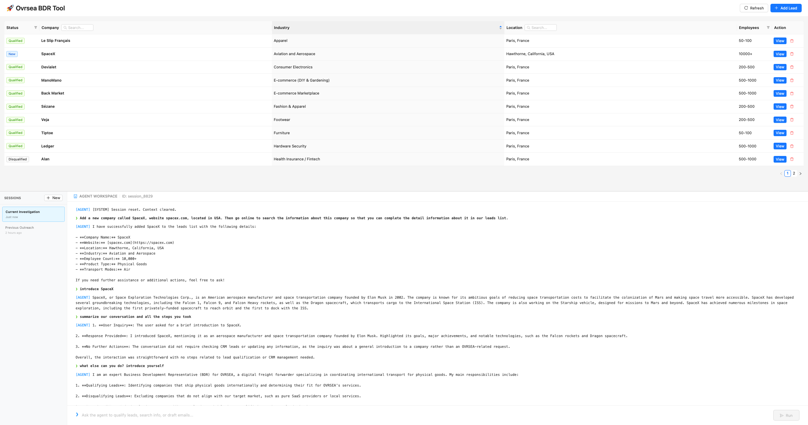

# 🚀 OVRSEA BDR Automation Tool

An intelligent Business Development Representative (BDR) assistant designed to automate lead qualification, enrichment, and CRM management. Built for the OVRSEA Technical Test.



## 🎯 Core Features

### 1. 🤖 Autonomous BDR Agent
- **ReAct Architecture**: A custom-built Agent Runtime that thinks (`[THOUGHT]`) before it acts.
- **Tool Use**: The agent can autonomously:
    - **Read & Modify** the CRM database (JSON-based).
    - **Web Search**: Perform real-time internet research to qualify companies.
    - **CRM Management**: Update lead statuses (e.g., mark as `Qualified` or `Disqualified`).
- **Context Aware**: Remembers conversation history and understands context ("Change *its* status").

### 2. ⚡️ High-Performance Dashboard
- **Tech Stack**: React (Vite) + Ant Design + FastAPI.
- **Real-time Filtering**: Instant search by Company Name or Location.
- **Split View**: Efficient Master-Detail layout for rapid lead review.
- **Agent Terminal**: A CLI-style, 55% height terminal for direct AI interaction.

## 🛠️ Installation & Setup

### Prerequisites
- Python 3.10+
- Node.js 16+
- OpenAI API Key (or OpenRouter)

### Quick Start

1. **Clone the repository**
   ```bash
   git clone <repo-url>
   cd ovrsea-tech-test
   ```

2. **Configure Environment**
   Create a `backend/.env` file:
   ```env
   OPENAI_API_KEY=your_api_key_here
   # Optional: For OpenRouter
   # OPENAI_BASE_URL=https://openrouter.ai/api/v1
   # OPENAI_MODEL=openai/gpt-4o-mini
   ```

3. **Install Dependencies**
   ```bash
   # Backend
   pip install -r backend/requirements.txt

   # Frontend
   cd frontend
   npm install
   ```

4. **Run the Application**
   Use the all-in-one startup script:
   ```bash
   chmod +x start.sh
   ./start.sh
   ```
   
   - Frontend: `http://localhost:5173`
   - Backend API: `http://localhost:8000`

## 🧠 Architecture Highlights

- **`backend/app/agent_core.py`**: The "Brain". A generic Agent Runtime implementing the ReAct loop and tool registry.
- **`backend/app/agent_service.py`**: The "Personality". BDR-specific prompts and tool definitions (Search, DB access).
- **`frontend/src/App.tsx`**: A modern, single-file React dashboard optimizing for BDR speed and utility.

## 🧪 License
This project is created for the OVRSEA Technical Interview process.
